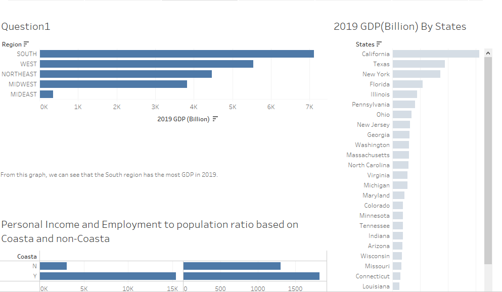

- 👋 Hi, I’m @Tianyang Yang
- 📫 I am a BA major senior student of University of Denver.
- 👀 I’m interested in Learning business analytics, playing video games.
- 🌱 I’m currently learning Data Warehousing and Project Management.
- 📫 How to reach me Tianyang.Yang@du.edu

# Career Aspiration
-Data Analyst

-Business Analyst

# Softwares and programming language
Visio Studio   /   Excel     /  Tableau     /  JMP      /   SQL Server    /   Python /   VBA 

# My Projects

-For this project, by using Tableau and JMP skills, I made charts and tables to analyze the performance of each predicting model in forecasting the State's GDP and Wealthy.

<!---
782214104/782214104 is a ✨ special ✨ repository because its `README.md` (this file) appears on your GitHub profile.
You can click the Preview link to take a look at your changes.
--->
